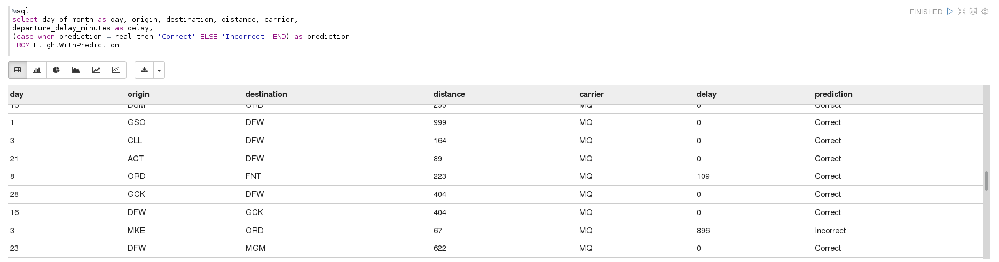

### Intro & Use case
In this post we will show how to you can use InsightEdge to do a real time prediction for flights delay. We will improve solution based on a decision tree algorithm described by Carol McDonald in her MapR [blog post](https://www.mapr.com/blog/apache-spark-machine-learning-tutorial).
 
### Architecture

The following slide shows us one the possible solutions which suits for our task.


For performing real time predictions we are going to se Spark Streaming technology combined with Apache Kafka which will simulate endless and continuous data flow. Streamed data will be processed by Decision Tree model and results are saved into Data Grid for future usage.

The solution consist from two parts(Spark jobs):
- Model training
- Real time flight prediction

Let's see two Spark jobs in details

#### 'Model training' Spark job

Model training job is one-time job which designed to do model initial training. We won't drill deep in details of machine learning algorithms and decision tree model training, you can familiarize yourself in Carol McDonald's blog post mentioned earlier.
First Spark job will load data from local file system, train model and save it to the grid for later usage.

```python

flight_data_file = ...
sc = SparkContext(appName="Flight prediction model training")
ssc = StreamingContext(sc, 3)

text_rdd = sc.textFile(flight_data_file)

```

File with data + load + flight parse
Splitting data into training and test
Train model
Save to grid

#### 'Flight prediction' Spark job
Second Spark job will load model from the grid, read data from stream and use the model for prediction. Prediction results are stored in the grid alongside with flight data.
Load model and helper data from grid
Simple Kafka feeder
Open Kafka stream + use function for each rdd
Parse and prepare data  + predict
Save parsed data + prediction to grod


### Showing results

For data
Final data example



Correct predictions count VS Incorrect predictions count


### Next steps

1. Better model
2. Update model logic - Batch update
3. Update model logic - Iterative model
