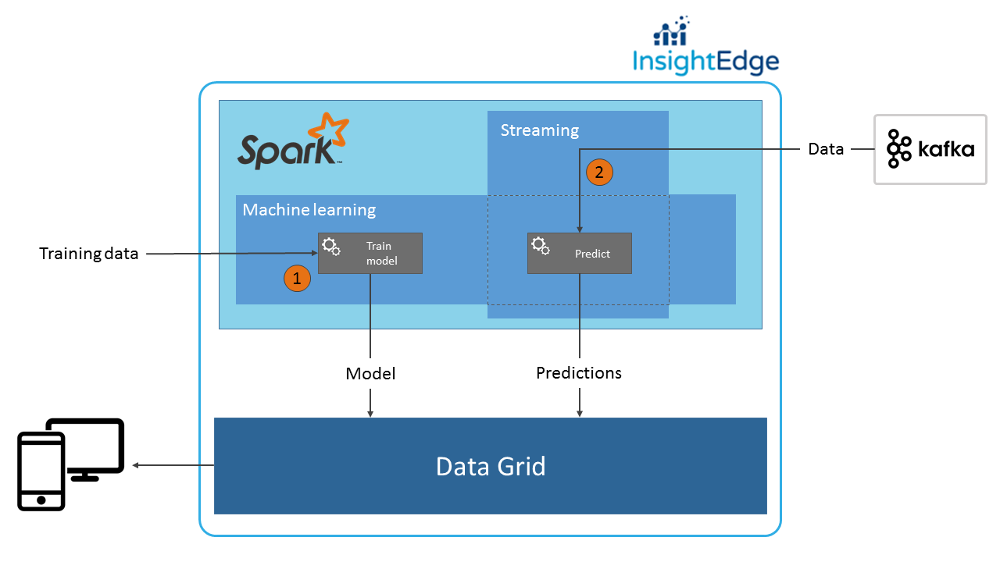

In this post we will show how to you can use InsightEdge to do a real time prediction for flights delay.
Why would you do a flight delay prediction?
For clients it gives a more accurate expectation about flight time thus gives an ability to plan their time accordingly.
For airlines companies it shows where they can minimize flight delays thereby minimize expenses and increase customers satisfaction.  

We will create a solution based on a decision tree algorithm described by Carol McDonald in her MapR [blog post](https://www.mapr.com/blog/apache-spark-machine-learning-tutorial).

### Architecture

The following slide shows us one the possible solutions which suits for our task.



For performing real time predictions we are going to use Spark Streaming technology combined with Apache Kafka which will simulate endless and continuous data flow.
For the hardest part, prediction, we are going to use Spark Machine Learning technology and [decision tree algorithm](https://spark.apache.org/docs/1.6.0/mllib-decision-tree.html).
Streamed data will be processed by a decision tree model and results are saved into InsightEdge data grid for future usage.

The solution consist from two parts(Spark jobs):
* Model training
* Flight delay prediction

Let's see jobs in details. All code and instructions are available on [github](https://github.com/InsightEdge/insightedge-python-demo)


#### 'Model training' Spark job

Model training job is one-time job which designed to do model initial training and store it in the data grid so the model can be used during the second job.
We won't drill deep into details of machine learning algorithms and decision tree model training, you can familiarize yourself with it in Carol McDonald's blog post which was mentioned earlier.

Job consists of next simple steps:

* Load data, split it on training and testing part, save testing part for second job usage. We will use the same [data set](https://github.com/InsightEdge/insightedge-python-demo/blob/master/data/flights_jan_2014.csv) as in Carol McDonald's blog. 
```python
flight_data_file = ...
sc = SparkContext(appName="Flight prediction model training")

text_rdd = sc.textFile(flight_data_file)
splits = text_rdd.randomSplit([0.7, 0.3])
(training_rdd, test_rdd) = (splits[0], splits[1])
test_rdd.coalesce(1, True).saveAsTextFile(...)
```

* During the second job we will convert flight data into LabeledPoint so we will need to store integer representations of origin, destination and carrier in the data grid.
```python
all_flights_rdd = text_rdd.map(lambda r: Utils.parse_flight(r))

carrier_mapping = dict(all_flights_rdd.map(lambda flight: flight.carrier).distinct().zipWithIndex().collect())
origin_mapping = dict(all_flights_rdd.map(lambda flight: flight.origin).distinct().zipWithIndex().collect())
destination_mapping = dict(all_flights_rdd.map(lambda flight: flight.destination).distinct().zipWithIndex().collect())

sqlc = SQLContext(sc)
save_mapping(carrier_mapping, DF_SUFFIX + ".CarrierMap", sqlc)
save_mapping(origin_mapping, DF_SUFFIX + ".OriginMap", sqlc)
save_mapping(destination_mapping, DF_SUFFIX + ".DestinationMap", sqlc)
```

* Last step is to train a model and save it to the data grid
```python
training_data = training_rdd.map(Utils.parse_flight).map(lambda rdd: Utils.create_labeled_point(rdd, carrier_mapping, origin_mapping, destination_mapping))
classes_count = 2
impurity = "gini"
max_depth = 9
max_bins = 7000
model = DecisionTree.trainClassifier(training_data, classes_count, categorical_features_info, impurity, max_depth, max_bins)
Utils.save_model_to_grid(model, sc)
```


#### 'Flight delay prediction' Spark job

Second Spark job loads model and mappings from the grid, read data from stream and use the model for prediction. Predictions will be stored in the grid alongside with flight data.
Let's see main steps:

* Load models and mappings form data grid
```python
sc = SparkContext(appName="Flight delay prediction job")
model = DecisionTreeModel(Utils.load_model_from_grid(sc))

sqlc = SQLContext(sc)
carrier_mapping = load_mapping(DF_SUFFIX + ".CarrierMap", sqlc)
origin_mapping = load_mapping(DF_SUFFIX + ".OriginMap", sqlc)
destination_mapping = load_mapping(DF_SUFFIX + ".DestinationMap", sqlc)
```

* Open Kafka stream and parse lines with flight data
```python
ssc = StreamingContext(sc, 3)
kvs = KafkaUtils.createStream(ssc, zkQuorum, "spark-streaming-consumer", {topic: 1})
lines = kvs.map(lambda x: x[1])
```

* Final step is to parse bunch of lines(rdd), do a prediction and save it to the data grid 
```python
lines.foreachRDD(predict_and_save)

def predict_and_save(rdd):
    if not rdd.isEmpty():
        parsed_flights = rdd.map(Utils.parse_flight)
        labeled_points = parsed_flights.map(lambda flight: Utils.create_labeled_point(flight, carrier_mapping, origin_mapping, destination_mapping))

        predictions = model.predict(labeled_points.map(lambda x: x.features))
        labels_and_predictions = labeled_points.map(lambda lp: lp.label).zip(predictions).zip(parsed_flights).map(to_row())

        df = sqlc.createDataFrame(labels_and_predictions)
        df.write.format(IE_FORMAT).mode("append").save(DF_SUFFIX + ".FlightWithPrediction")
```


### Running demo and examining results

To run the demo we need to perform next steps:

1. Start up InsightEdge.
2. Start up Kafka and create a topic.
3. Submit Model Training job.
4. Submit Flight Prediction job.
5. Push the test data into Kafka's topic.

You can find detailed instruction [here](https://github.com/InsightEdge/insightedge-python-demo/blob/master/README.md).

After all steps are done we can examine what was stored in the data grid. Open Zeppelin at http://127.0.0.1:8090, and import a [notebook]() !TODO add zeppelin notebook.!
Below you can see example of stored data where:
* day - is day of the month
* origin - origin airport
* destionation - destination airport
* distance - distance between airports in miles
* carrier - airline company
* actual_delay_minutes - actual flight delay in minutes
* prediction - whether our model did a correct or an incorrect prediction


Since we store prediction result alongside with actual flight delay we can see ratio of correct and incorrect predictions:


### What's next?

In this article we built simple real time prediction application using Spark ML combined with Spark Streaming on top of InsightEdge. We haven't built perfect solution and there are ways to improve it, eg:

* You may want to take a look at other ML algorithm or tune existing one to give a better prediction rate.
* During the time model might become outdated. In order to keep it up to date we need to come up with model update strategy. Two possible solutions are to use incremental algorithm and periodical model retraining.
  * Incremental algorithms: model build on such algorithms will update itself every time it faces with new data.
  * Periodical model retraining: the solution is to store income data and periodically preform model retraining and substitute existing model with updated one.
  